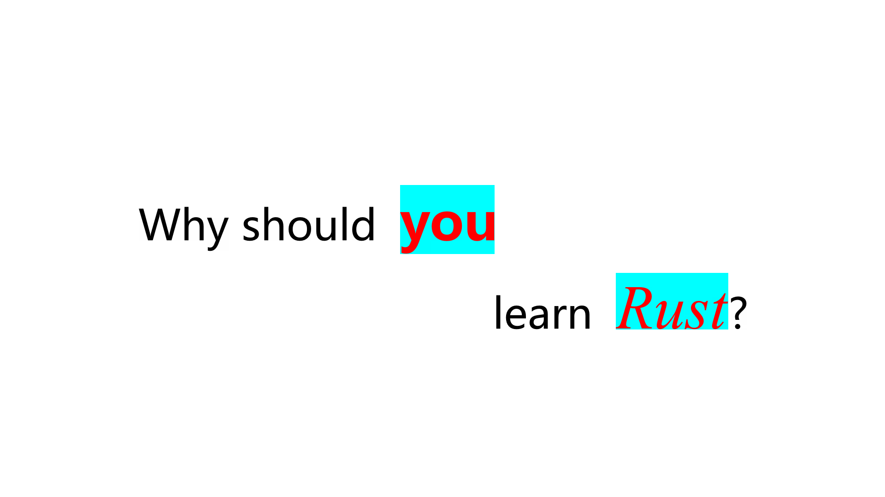
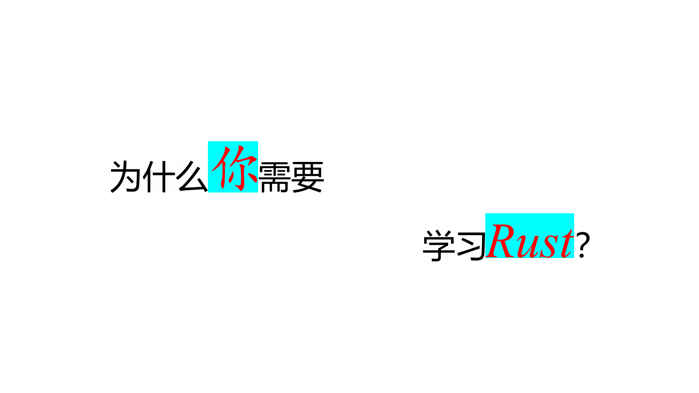

# Text Cover

[](LICENSE)

A very small cli tool written in Rust to convert a piece of text to image. 

This is mainly designed to use the text image as a video cover.

## Usage

Clone the code, and run:

```bash
cargon install --path .
```

Once the project is built, the executable file will be installed to the local binary path, which by default is `~/.cargo/bin`.

```bash
Usage: text-cover.exe [OPTIONS] --input-path <INPUT_PATH> --output-path <OUTPUT_PATH>

Options:
      --image-width <IMAGE_WIDTH>            [default: 1920]
      --image-height <IMAGE_HEIGHT>          [default: 1080]
      --padding <PADDING>                    [default: 300]
      --background-color <BACKGROUND_COLOR>  [default: #FFFFFFFF]
  -i, --input-path <INPUT_PATH>
  -o, --output-path <OUTPUT_PATH>
  -h, --help                                 Print help
```

* input-path: the input text file path. The text format is based on html.
* output-path: the output image file path.

You can customize the image output by passing other optional parameters like background-color.

## Examples

### 1

**input**:

```
Why should <font size='150' color='#FF0000' background='#00FFFF' weight='bold'>you</font>
learn <font size='150' color='#FF0000' background='#00FFFF' style='italic' family='Times New Roman'>Rust</font>?
```

**output**:




### 2

**input**:

```
为什么<font size='150' color='#FF0000' background='#00FFFF' weight='bold' family='kaiti'>你</font>需要
学习<font size='150' color='#FF0000' background='#00FFFF' style='italic' family='Times New Roman'>Rust</font>？
```

**output**:




